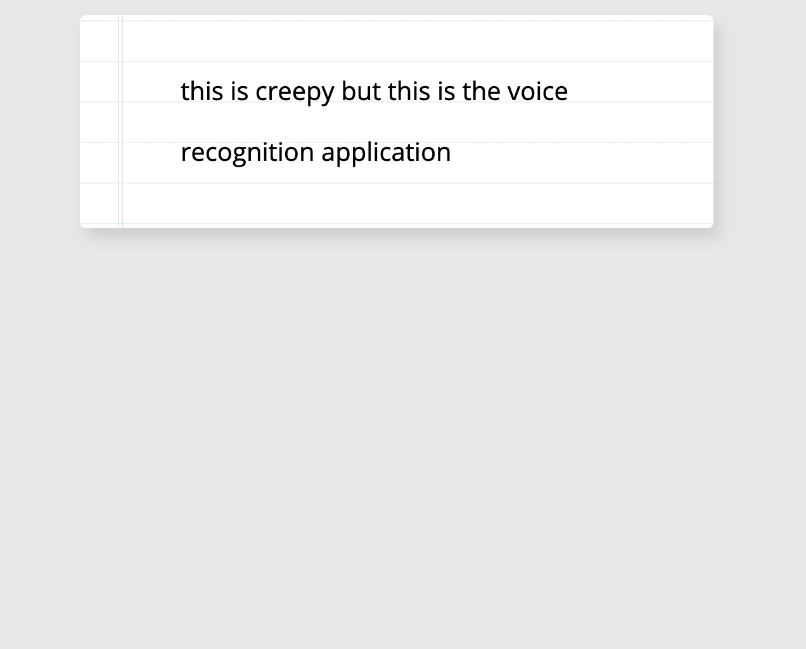

# 20. Speech Detection

#### _Speech Detection by JavaScript30 10/22/19_

## Description
This is Speech Detection, 20th application out of 30 by 30 day Vanilla JavaScript Coding Challenge by Wes Bos.<br>
Please check the challenge from [JavaScript30](http://wesbos.com/javascript30/).




## About this Application:
- Accessing the microphone and show the transcript on the screen

- This application is only available on Chrome and Android. [Speech Recognition API](https://developer.mozilla.org/en-US/docs/Web/API/SpeechRecognition).

- Please allow the microphone access to use this application.

- When you pause speaking, it'll move to the next line.

## Setup/Installation

1. Clone this repo:
```
$ git clone https://github.com/misakimichy/JS30-20-speech-detection.git
```

2. Go into this repo and install npm:
```
npm install
```

3. Once the npm is installed, run the server:
```
npm run start
```

4. The browser will ask you the microphone access.

## Known Bugs
* No known bugs at this time.

## Support and contact details
 I welcome any feedbacks and comments: misaki.koonce@gmail.com

## Technologies Used
_Git, GitHub, HTML, CSS, Vanilla JavaScript and webpack

## License
Copyright © 2019 under the MIT License